# Database Schema and Data Model V3

All database interactions must use Supabase PostgreSQL. Use this schema as the **single source of truth** for all migrations, TypeScript types, RLS policies, and API routes. Do not invent fields or tables not listed here. If a new field is needed, propose it and update this file first.

---

## Entity Relationship Diagram

Use this ERD as a migration-planning aid alongside the table definitions below. It clarifies one-to-many, one-to-one, optional, and many-to-many relationships so Gemini does not invent connectors or mis-order foreign keys during SQL generation.

```mermaid
erDiagram
    organizations ||--o{ profiles : has
    organizations ||--o{ tenders : owns
    organizations ||--o{ supplier_submissions : submits
    organizations ||--o{ tender_clarifications : asks
    organizations o|--o{ tender_templates : owns
    organizations o|--o{ tender_invitations : linked_after_registration
    organizations ||--o{ tender_messages : sends
    organizations ||--o{ tender_message_recipient_groups : addressed_to
    organizations ||--o{ communications_log : receives
    organizations ||--o{ audit_logs : belongs_to
    organizations ||--o{ supplier_tender_unlocks : purchases
    tenders ||--o{ supplier_tender_unlocks : unlocked_by

    profiles ||--o{ tender_amendments : amends
    profiles ||--o{ tender_attachments : uploads
    profiles ||--o{ supplier_document_views : views
    profiles ||--o{ supplier_submissions : submits
    profiles ||--o{ evaluations : evaluates
    profiles ||--o{ tender_invitations : invites
    profiles ||--o{ tender_messages : authors
    profiles o|--o{ audit_logs : user_id

    tender_templates o|--o{ tenders : used_by

    tenders ||--o{ tender_regulations : maps
    regulations ||--o{ tender_regulations : mapped_to

    tenders ||--|| tender_submission_config : configures
    tenders ||--o{ tender_amendments : has
    tenders ||--o{ tender_attachments : has
    tenders ||--o{ supplier_submissions : receives
    tenders ||--o{ tender_criteria : defines
    tenders ||--o{ tender_clarifications : has
    tenders ||--o{ tender_invitations : sends
    tenders ||--o{ submission_review_labels : defines
    tenders ||--o{ tender_messages : contains
    tenders o|--o{ communications_log : delivers
    tenders o|--o| supplier_submissions : awarded_to

    tender_attachments ||--o{ supplier_document_views : logged_for

    submission_review_labels ||--o{ supplier_submissions : labels
    supplier_submissions ||--o{ submission_team_profiles : contains
    supplier_submissions ||--o{ submission_budget_items : contains
    supplier_submissions ||--o{ submission_answers : contains
    supplier_submissions ||--o{ submission_attachments : contains
    supplier_submissions ||--o{ evaluations : scored_by
    supplier_submissions ||--|| submission_results : rolls_up_to
    supplier_submissions o|--o{ tender_messages : discusses

    tender_criteria ||--o{ evaluations : measures

    tender_messages ||--o{ tender_message_recipient_groups : addressed_to
    tender_messages ||--o{ tender_message_attachments : includes
    tender_messages o|--o{ communications_log : logged_as
```

**Implementation note 1:** `tenders.awarded_to_submission_id` creates a circular relationship with `supplier_submissions`. In SQL migrations, create both base tables first, then add `awarded_to_submission_id` afterward with `ALTER TABLE` if needed to avoid foreign-key ordering issues.

**Implementation note 2:** `submission_answers.question_id` is not a foreign key to a separate table. It maps to `tender_submission_config.custom_questions[].id` stored inside JSON.

**Implementation note 3:** Every outbound email must create one canonical `tender_messages` record for in-app history, plus one or more `communications_log` rows for actual email delivery tracking.

---

## Database Extensibility Principles

To ensure this database can adapt to future requirements without breaking existing code, the Database Architect must follow these rules:
1. **Migration-Based Evolution**: All schema changes must be done via incremental Supabase migrations (`YYYYMMDDHHMMSS_add_new_field.sql`), never by destroying and recreating tables.
2. **Strategic JSONB usage**: We utilize PostgreSQL's `JSONB` column type for data that is highly variable or changes frequently. Tables like `organizations` (`public_portal_config`, `master_compliance_data`) and `tender_submission_config` (`custom_questions`) use JSONB so new settings can be added by the frontend without requiring a backend database migration.
3. **Nullable by Default**: When adding new columns to existing tables in the future, they must be nullable or have a default value to prevent breaking older records.

## 1. Core Identity & Access

### `organizations`
- `id` (uuid, primary key, default: gen_random_uuid())
- `name` (text, not null) — Trading name
- `registered_name` (text) — Formal legal entity name
- `registration_number` (text) — Company registration number (e.g., Companies House CRN, EIN)
- `tax_id` (text) — VAT number or Tax ID
- `address_line1` (text)
- `address_line2` (text)
- `city` (text)
- `state_province` (text)
- `postal_code` (text)
- `country` (text, not null)
- `website_url` (text)
- `primary_contact_email` (text, not null) — Main org-level email, independent of user profiles
- `type` (text, not null) — strictly `'buyer'` or `'supplier'`
- `industry_sector` (text) — e.g., 'Financial Services', 'Manufacturing'
- `size_category` (text) — e.g., 'Micro', 'SME', 'Enterprise'

- `public_portal_config` (jsonb) — buyer-only: `{ logo_url, brand_color, banner_image_url, subdomain, legal_docs_urls[] }`
- `master_compliance_data` (jsonb) — supplier-only: reusable certs, ISO docs, standard policy uploads
- `stripe_customer_id` (text)
- `lead_profile_id` (uuid, nullable, references profiles) — the designated organisational lead. Only this person can agree to T&Cs and submit tenders. If the lead changes, terms must be re-accepted.
- `terms_accepted_at` (timestamptz) — when the current lead accepted the platform T&Cs
- `terms_accepted_by` (uuid, nullable, references profiles) — the profile_id of the lead who accepted
- `created_at` (timestamptz, default: now())
- `updated_at` (timestamptz, default: now())

### `profiles` (extends auth.users)
*Each authenticated user has one profile linked to one organization.*
- `id` (uuid, primary key, references auth.users)
- `organization_id` (uuid, not null, references organizations)
- `first_name` (text)
- `last_name` (text)
- `role` (text, not null) — use the exact values below. Do not invent new roles.
  - Buyer side: `'buyer_admin'` | `'buyer_editor'` | `'buyer_viewer'`
  - Supplier side: `'supplier_admin'` | `'supplier_editor'` | `'supplier_viewer'`
  - Platform: `'platform_admin'`
- `is_org_lead` (boolean, default: false) — true for the designated lead of the supplier organisation. Only one lead per organisation is allowed.
- `created_at` (timestamptz, default: now())

**Role permissions matrix:**
| Role | Can Submit Bid | Can Edit Draft | Can View | Can Publish Tender | Can Award |
|---|---|---|---|---|---|
| buyer_admin | — | ✅ | ✅ | ✅ | ✅ |
| buyer_editor | — | ✅ | ✅ | ❌ | ❌ |
| buyer_viewer | — | ❌ | ✅ | ❌ | ❌ |
| supplier_admin | ✅ | ✅ | ✅ | — | — |
| supplier_editor | ❌ | ✅ | ✅ | — | — |
| supplier_viewer | ❌ | ❌ | ✅ | — | — |
| platform_admin | ✅ | ✅ | ✅ | ✅ | ✅ |

---

## 2. Regulatory Framework & Templates

### `regulations` (Platform-managed master list)
- `id` (uuid, primary key)
- `name` (text, not null) — e.g., `'CSRD'`, `'ISSB S1'`, `'ISSB S2'`, `'SFDR'`, `'TCFD'`, `'GRI'`
- `version` (text) — e.g., `'2025-01'` — tracks regulatory updates
- `description` (text)
- `jurisdiction` (text) — e.g., `'EU'`, `'UK'`, `'Global'`
- `required_clauses` (jsonb) — AI uses this to auto-populate RFP text when regulation is selected
- `interview_questions` (jsonb) — array of questions the AI wizard should ask the buyer to determine if/how this regulation applies
- `scoring_prompts` (text) — instructions for the AI on how to evaluate supplier responses against this regulation
- `created_at` (timestamptz)

### `tender_templates` (The Template Library)
*`organization_id` is null for platform-wide default templates. Buyers can save their own.*
- `id` (uuid, primary key)
- `organization_id` (uuid, nullable, references organizations) — null = system default
- `name` (text, not null) — e.g., `'CSRD Readiness Software'`, `'Scope 3 Consulting'`
- `description` (text)
- `category` (text) — e.g., `'Emissions Reporting'`, `'Physical Climate Risk'`, `'ESG Advisory'`
- `config` (jsonb) — stores default criteria, custom questions, regulation ids, and submission config
- `is_public` (boolean, default: false) — buyer-created templates they choose to share
- `created_at` (timestamptz)
- `updated_at` (timestamptz)

---

## 2a. AI Configurations

### `supplier_copilot_sessions` (Supplier AI Assistant Conversations)
*Each supplier has a persistent AI copilot that guides them through bid completion.*
- `id` (uuid, primary key)
- `tender_id` (uuid, not null, references tenders, on delete cascade)
- `supplier_org_id` (uuid, not null, references organizations)
- `profile_id` (uuid, not null, references profiles)
- `messages` (jsonb, default: '[]') — array of `{role: 'user'|'assistant', content: string, timestamp: timestamptz, tool_calls: []}`
- `context` (jsonb) — stores active tab, submission completion %, missing items
- `created_at` (timestamptz, default: now())
- `updated_at` (timestamptz, default: now())

### `buyer_copilot_sessions` (Persistent AI Agent Conversations)
*Each buyer workspace has a persistent AI copilot that answers questions and executes actions. This table stores the conversation history.*
- `id` (uuid, primary key)
- `tender_id` (uuid, not null, references tenders, on delete cascade)
- `profile_id` (uuid, not null, references profiles)
- `messages` (jsonb, default: '[]') — array of `{role: 'user'|'assistant', content: string, timestamp: timestamptz, tool_calls: []}`
- `context` (jsonb) — stores active tab, filters, recent actions for context awareness
- `created_at` (timestamptz, default: now())
- `updated_at` (timestamptz, default: now())

### `tender_wizard_sessions` (Conversational AI State)
*Stores the multi-turn chat history when a buyer is using the AI to draft an RFP.*
- `id` (uuid, primary key)
- `tender_id` (uuid, not null, references tenders, on delete cascade)
- `profile_id` (uuid, not null, references profiles)
- `messages` (jsonb, default: '[]') — array of `{role: 'user'|'model', content: string}`
- `status` (text, default: 'In Progress') — `'In Progress'` | `'Completed'`
- `created_at` (timestamptz, default: now())
- `updated_at` (timestamptz, default: now())

### `ai_model_config` (Flexible AI Provider Mapping)
*Allows the platform to change models per use-case without deploying new code.*
- `use_case` (text, primary key) — e.g., `'wizard_chat'`, `'rfp_generation'`, `'submission_scoring'`, `'audit_summary'`
- `provider` (text, not null) — e.g., `'gemini'`, `'openai'`, `'anthropic'`
- `model_name` (text, not null) — e.g., `'gemini-2.5-flash'`, `'gpt-4o'`
- `temperature` (numeric, default: 0.7)
- `system_prompt_override` (text) — optional override for the hardcoded prompt
- `is_active` (boolean, default: true)

---

## 3. Tenders

### `tenders`
- `id` (uuid, primary key)
- `organization_id` (uuid, not null, references organizations)
- `template_id` (uuid, nullable, references tender_templates) — which template was used
- `title` (text, not null)
- `description` (text)
- `status` (text, not null) — use ONLY these exact values:
  `'draft'` | `'open_for_proposals'` | `'closed'` | `'under_review'` | `'awarded'` | `'withdrawn'` | `'archived'`
- `visibility` (text, default: `'Private'`) — `'Private'` | `'Public'`
- `public_listing_fee_paid` (boolean, default: false) — true if buyer paid £200 to open to marketplace
- `public_listing_stripe_payment_id` (text) — Stripe PaymentIntent ID for the £200 listing fee; used for idempotency and dispute resolution
- `publish_at` (timestamptz) — scheduled go-live date. If null, publishes immediately upon buyer confirmation.
- `rfp_document_draft` (jsonb) — stores the rich-text TipTap JSON state of the AI-generated RFP before it is confirmed and baked into a PDF
- `submission_deadline` (timestamptz, not null before publication)
- `qa_deadline` (timestamptz) — deadline for suppliers to ask questions
- `private_invite_count` (integer, default: 0) — server-managed count of invitations sent. Free tier is capped at 3. Incremented on each `tender_invitations` insert.
- `version` (integer, default: 1) — increments on every published amendment
- `budget_range` (text) — optional indicative budget displayed on public portal
- `contact_email` (text) — buyer contact shown on public portal
- `audit_report_pdf_url` (text) — generated upon award
- `submission_archive_zip_url` (text) — generated upon award
- `ai_defensibility_summary` (text) — AI-generated plain-English integrity summary, saved to audit PDF
- `buyer_internal_notes` (text) — buyer-only short notes shown on the tender workspace
- `awarded_to_submission_id` (uuid, nullable, references supplier_submissions)
- `awarded_at` (timestamptz)
- `standstill_period_ends_at` (timestamptz) — mandatory cooling-off period before formal contract signing
- `buyer_signature_id` (text) — reference to external e-signature provider for the buyer
- `supplier_signature_id` (text) — reference to external e-signature provider for the winning supplier
- `final_contract_value` (numeric) — confirmed by buyer upon award
- `success_fee_status` (text) — `'Pending'` | `'Invoiced'` | `'Paid'`
- `success_fee_invoice_url` (text) — link to 5% supplier invoice via Stripe
- `supplier_performance_rating` (integer) — 1-5 star rating given by buyer after project completion
- `supplier_performance_review` (text) — qualitative review given by buyer
- `created_at` (timestamptz)
- `updated_at` (timestamptz)

### `tender_regulations` (Many-to-many mapping)
- `tender_id` (uuid, references tenders, on delete cascade)
- `regulation_id` (uuid, references regulations)
- Primary key: (`tender_id`, `regulation_id`)

### `tender_amendments` (Version history)
*Created every time a published tender is modified.*
- `id` (uuid, primary key)
- `tender_id` (uuid, not null, references tenders)
- `version_number` (integer, not null)
- `change_summary` (text) — AI-generated or human description of what changed
- `amended_by` (uuid, references profiles)
- `created_at` (timestamptz)

### `tender_submission_config` (Dynamic Form Builder)
*One record per tender. Dictates what the supplier must or can submit.*
- `tender_id` (uuid, primary key, references tenders, on delete cascade)
- `require_executive_summary` (boolean, default: true)
- `require_budget_table` (boolean, default: false)
- `require_team_profiles` (boolean, default: false)
- `allow_custom_attachments` (boolean, default: true)
- `require_total_price` (boolean, default: true)
- `custom_questions` (jsonb) — array of question objects:
  `[{ "id": "q1", "question": "Describe your methodology", "mandatory": true, "type": "text|number|file|select" }]`

### `supplier_tender_unlocks` (Pay-to-access public tender tracking)
*Tracks which supplier organisations have paid to unlock a public tender's documents and submission flow.
RLS on `tender_documents` storage bucket must check for a matching row here before serving files to uninvited suppliers.*
- `id` (uuid, primary key, default: gen_random_uuid())
- `tender_id` (uuid, not null, references tenders, on delete cascade)
- `supplier_org_id` (uuid, not null, references organizations)
- `stripe_payment_intent_id` (text, not null) — Stripe PaymentIntent ID. NOTE: This row must ONLY be created via a successful Stripe webhook (`payment_intent.succeeded`), never directly by the client.
- `amount_paid` (numeric, not null) — should always equal the platform unlock fee at time of payment
- `currency` (text, default: 'GBP')
- `unlocked_at` (timestamptz, default: now())
- Unique constraint: (`tender_id`, `supplier_org_id`) — a supplier can only unlock a tender once

---

## 4. Files & Attachments

### `tender_attachments` (Buyer-uploaded files for the tender)
- `id` (uuid, primary key)
- `tender_id` (uuid, not null, references tenders)
- `uploaded_by` (uuid, references profiles)
- `file_url` (text, not null) — Supabase Storage path
- `file_name` (text, not null)
- `file_size` (integer) — bytes, for storage enforcement
- `mime_type` (text) — server-validated, not client-provided
- `is_public` (boolean, default: true) — false = internal buyer document only
- `display_order` (integer) — controls download list order on public portal
- `created_at` (timestamptz)

### `supplier_document_views` (Immutable audit: who viewed what)
*Append-only. Never update or delete rows.*
- `id` (uuid, primary key)
- `tender_attachment_id` (uuid, references tender_attachments)
- `viewed_by_profile_id` (uuid, references profiles)
- `viewed_at` (timestamptz, default: now())

---

## 5. Supplier Submissions

### `supplier_submissions`
- `id` (uuid, primary key)
- `tender_id` (uuid, not null, references tenders)
- `supplier_org_id` (uuid, not null, references organizations)
- `status` (text, not null) — use ONLY these exact values:
  `'draft'` | `'submitted'` | `'withdrawn'` | `'disqualified'` | `'under_review'` | `'awarded'` | `'not_awarded'`
- `review_label_id` (uuid, nullable, references submission_review_labels) — buyer-defined triage label such as `Consider`, `Reject`, or `Follow Up`
- `total_bid_amount` (numeric) — top-level price
- `currency` (text, default: `'GBP'`) — ISO 4217
- `executive_summary` (text)
- `submission_pdf_url` (text) — generated PDF of structured form answers for download and audit
- `agreed_to_success_fee` (boolean, default: false) — supplier checked the mandatory 5% fee box at submission
- `success_fee_agreed_at` (timestamptz) — timestamp of when the fee was agreed
- `submitted_by` (uuid, references profiles)
- `submitted_at` (timestamptz)
- `created_at` (timestamptz)
- `updated_at` (timestamptz)

### `submission_review_labels` (Buyer-defined submission labels)
*Per-tender dropdown values for quick triage in the submissions table. Buyers can amend the label set over time.*
- `id` (uuid, primary key)
- `tender_id` (uuid, not null, references tenders, on delete cascade)
- `name` (text, not null) — e.g., `'Consider'`, `'Reject'`, `'Follow Up'`
- `description` (text)
- `color` (text) — optional UI badge color token
- `display_order` (integer)
- `is_active` (boolean, default: true)
- `created_at` (timestamptz)

### `submission_team_profiles`
- `id` (uuid, primary key)
- `submission_id` (uuid, not null, references supplier_submissions, on delete cascade)
- `name` (text)
- `role_title` (text)
- `bio` (text)
- `day_rate` (numeric)
- `currency` (text, default: `'GBP'`)
- `display_order` (integer)

### `submission_budget_items`
- `id` (uuid, primary key)
- `submission_id` (uuid, not null, references supplier_submissions, on delete cascade)
- `category` (text) — e.g., `'Software License'`, `'Consulting Hours'`
- `description` (text)
- `amount` (numeric)
- `currency` (text, default: `'GBP'`)
- `display_order` (integer)

### `submission_answers` (Responses to custom questions)
- `id` (uuid, primary key)
- `submission_id` (uuid, not null, references supplier_submissions, on delete cascade)
- `question_id` (text, not null) — maps to `custom_questions[].id` in `tender_submission_config`
- `answer_text` (text)

### `submission_attachments` (Supplier-uploaded files)
- `id` (uuid, primary key)
- `submission_id` (uuid, not null, references supplier_submissions, on delete cascade)
- `file_url` (text, not null)
- `file_name` (text, not null)
- `file_size` (integer)
- `mime_type` (text)
- `file_type` (text) — buyer-defined category: `'Pricing Schedule'` | `'Methodology'` | `'Security Cert'` | `'Team CVs'` | `'General'`
- `created_at` (timestamptz)

---

## 6. Evaluation & Scoring Engine

### `tender_criteria` (The Rubric)
*Buyers define these before publication. `SUM(weight_percentage)` must equal 100.*
- `id` (uuid, primary key)
- `tender_id` (uuid, not null, references tenders)
- `title` (text, not null) — e.g., `'Pricing'`, `'ESG Compliance'`
- `description` (text, not null) — explicit scoring guidance for AI and human evaluators
- `weight_percentage` (numeric, not null) — e.g., `20.00`
- `max_score` (integer, default: 100)
- `is_mandatory` (boolean, default: false) — if true, score of 0 triggers automatic disqualification
- `display_order` (integer) — controls order in scoring UI
- `created_at` (timestamptz)

### `evaluations` (Line-item scores per criterion per submission)
*AI populates first. Humans review and override. The human score is authoritative.*
- `id` (uuid, primary key)
- `submission_id` (uuid, not null, references supplier_submissions)
- `criteria_id` (uuid, not null, references tender_criteria)
- `evaluator_id` (uuid, nullable, references profiles) — null = AI-only pass
- `ai_raw_score` (integer) — score out of `max_score` given by AI
- `ai_justification` (text) — narrative: why the submission meets the criterion
- `ai_deduction_reasoning` (text) — explicit: why points were deducted
- `human_raw_score` (integer) — final score, defaults to `ai_raw_score` until human edits
- `human_comment` (text) — evaluator internal notes
- `status` (text) — `'Pending AI'` | `'AI Scored'` | `'Human Reviewed'`
- `created_at` (timestamptz)
- `updated_at` (timestamptz)
- Unique constraint: (`submission_id`, `criteria_id`)

### `submission_results` (Topline roll-up — updated on every evaluation change)
*`rank` is NOT stored here. Calculate dynamically: `RANK() OVER (PARTITION BY tender_id ORDER BY total_weighted_score DESC)`*
- `id` (uuid, primary key)
- `submission_id` (uuid, unique, not null, references supplier_submissions)
- `total_weighted_score` (numeric) — `SUM((human_raw_score / max_score) * weight_percentage)`
- `is_disqualified` (boolean, default: false)
- `disqualification_reason` (text)
- `ai_overall_summary` (text) — max 150 words
- `ai_special_conditions` (text) — anomalous caveats, pricing outliers, compliance deviations

---

## 7. Q&A, Communications & Invitations

### `tender_clarifications` (Q&A Board)
- `id` (uuid, primary key)
- `tender_id` (uuid, not null, references tenders)
- `asked_by_org_id` (uuid, references organizations) — stored but never shown publicly
- `question_text` (text, not null)
- `question_html` (text) — for rich text rendering
- `answer_text` (text) — plain text fallback
- `answer_html` (text) — for rich text rendering — null until buyer responds
- `is_public` (boolean, default: false) — buyer explicitly publishes; supplier identity always anonymised
- `created_at` (timestamptz)
- `answered_at` (timestamptz)

### `tender_invitations` (Private tender access)
- `id` (uuid, primary key)
- `tender_id` (uuid, not null, references tenders)
- `supplier_email` (text, not null)
- `supplier_org_id` (uuid, nullable, references organizations) — populated once they register
- `invite_token` (uuid, not null, default: gen_random_uuid()) — cryptographic token for secure email link
- `status` (text) — `'Sent'` | `'Opened'` | `'Accepted'` | `'Declined'`
- `invited_by` (uuid, references profiles)
- `created_at` (timestamptz)
- `expires_at` (timestamptz)

### `tender_messages` (Canonical in-app communication per tender)
*All tender communication visible inside the tender workspace lives here, including internal chat-style messages and the canonical copy of outbound emails.*
- `id` (uuid, primary key)
- `tender_id` (uuid, not null, references tenders)
- `related_submission_id` (uuid, nullable, references supplier_submissions) — use when a message concerns one specific submission
- `sender_profile_id` (uuid, references profiles)
- `sender_org_id` (uuid, references organizations)
- `channel` (text, not null) — `'Internal'` | `'Email'`
- `status` (text, not null, default: `'Draft'`) — `'Draft'` | `'Queued'` | `'Sent'` | `'Failed'`
- `subject` (text)
- `body_text` (text)
- `body_html` (text) — used for rich email composition and rendering
- `is_visible_to_buyer` (boolean, default: true)
- `is_visible_to_supplier` (boolean, default: true)
- `created_at` (timestamptz)
- `updated_at` (timestamptz)
- `sent_at` (timestamptz)

### `tender_message_recipient_groups` (Organization-level recipients for a tender message)
*Email drafts may specify To/CC at the organization level; delivery fan-out then expands to all registered users in those organizations.*
- `id` (uuid, primary key)
- `message_id` (uuid, not null, references tender_messages, on delete cascade)
- `recipient_org_id` (uuid, not null, references organizations)
- `recipient_type` (text, not null) — `'To'` | `'CC'`
- `include_all_registered_users` (boolean, default: true)
- `created_at` (timestamptz)

### `tender_message_attachments` (Files attached to an in-app message or email draft)
- `id` (uuid, primary key)
- `message_id` (uuid, not null, references tender_messages, on delete cascade)
- `file_url` (text, not null)
- `file_name` (text, not null)
- `file_size` (integer)
- `mime_type` (text)
- `created_at` (timestamptz)

### `communications_log` (Per-recipient outbound email delivery audit)
*This tracks actual email delivery events. One sent email can produce many rows here, one per recipient, while still pointing back to one canonical `tender_messages` record.*
- `id` (uuid, primary key)
- `tender_message_id` (uuid, nullable, references tender_messages)
- `tender_id` (uuid, references tenders)
- `sender_id` (uuid, references profiles)
- `recipient_email` (text, not null)
- `recipient_profile_id` (uuid, nullable, references profiles)
- `recipient_org_id` (uuid, references organizations)
- `subject` (text)
- `body_text` (text)
- `body_html` (text)
- `communication_type` (text) — `'Invitation'` | `'QA_Update'` | `'Tender_Message'` | `'Award_Notice'` | `'Rejection_Notice'` | `'Amendment_Notice'` | `'General'`
- `status` (text, default: `'Queued'`) — `'Queued'` | `'Sent'` | `'Failed'` | `'Bounced'`
- `provider_message_id` (text) — Resend/provider delivery identifier
- `sent_at` (timestamptz)
- `created_at` (timestamptz)

---

## 8. Immutable Audit Trail

### `audit_logs`
*Append-only. Never update or delete rows. This is a legally defensible record.*
- `id` (uuid, primary key)
- `organization_id` (uuid, references organizations)
- `user_id` (uuid, nullable, references profiles) — null for system-triggered events
- `action` (text, not null) — use these exact values:
  `'TENDER_CREATED'` | `'TENDER_PUBLISHED'` | `'TENDER_AMENDED'` | `'DEADLINE_CHANGED'`
  `'SUPPLIER_INVITED'` | `'DOCUMENT_VIEWED'` | `'SUBMISSION_STARTED'` | `'SUBMISSION_SUBMITTED'`
  `'QA_ASKED'` | `'QA_PUBLISHED'` | `'SCORE_CHANGED'` | `'HUMAN_OVERRIDE'`
  `'TENDER_AWARDED'` | `'TENDER_WITHDRAWN'` | `'EMAIL_SENT'` | `'USER_ADDED'`
  `'SUBMISSION_WITHDRAWN'` | `'SUBMISSION_RETRACTED'` | `'INTENT_TO_BID'`
  `'FEE_INVOICED'` | `'FEE_PAID'` | `'TENDER_UNLOCKED'`
- `entity_type` (text) — e.g., `'tender'`, `'submission'`, `'evaluation'`, `'profile'`
- `entity_id` (uuid)
- `previous_value` (jsonb) — exact state before change
- `new_value` (jsonb) — exact state after change
- `ip_address` (text) — for fraud detection
- `timestamp` (timestamptz, default: now())

---

## Key Constraints & Rules for Gemini

1. `tenders.status` must always use the 10-value enum above. `'closed'` is the TENDER-level status set when `now() > submission_deadline` (enforced by the deadline-lock cron) or when the buyer manually closes the tender. Once a tender is `'closed'`, no new proposals may be submitted. The buyer then moves the tender to `'under_review'` to trigger the AI scoring queue. Never add new status values without updating this file.

**Submission Status Transitions:** Suppliers may move their proposal between `'draft'` and `'submitted'` freely, or set it to `'withdrawn'` to retract, at any time BEFORE the tender `submission_deadline` has passed AND BEFORE the buyer has moved the tender to `'under_review'`. Once either condition is true, no further status changes by the supplier are permitted. The only exception is `platform_admin`. Never add new status values without updating this file.
2. `supplier_submissions.status` must always use the 8-value enum above. Includes 'Declined'.
3. `profiles.role` must always use one of the 7 exact role strings above. RLS policies are built on these.
4. `submission_results.rank` is NEVER stored. Always use `RANK() OVER (...)` in queries.
5. `audit_logs` and `supplier_document_views` are append-only tables. No UPDATE or DELETE is ever permitted on these tables.
6. All file uploads must validate `mime_type` server-side. Never trust the client-provided MIME type.
7. All AI calls must be server-side only. Never call the Gemini API from client components.
8. `tender_criteria` weights must sum to 100 before a tender can be published. Validate this in the server action.
9. **qa_deadline enforcement:** The server action for creating a `tender_clarifications` row must check `now() < tenders.qa_deadline` before inserting. If the Q&A deadline has passed, return a 400 error and do not insert.

9. `submission_answers.question_id` maps to `tender_submission_config.custom_questions[].id` stored in JSON. Do not invent a separate `questions` table.
10. Every outbound email must create one canonical `tender_messages` row visible in the tender workspace and one or more `communications_log` rows for per-recipient delivery audit.
11. **Q&A broadcast:** When a buyer sets `tender_clarifications.is_public = true` (publishing an answer to all bidders), the server action MUST also create one canonical `tender_messages` record (channel: 'Email') and fan out a `communications_log` email to all organisations with active submissions on that tender, consistent with Rule 10.

11. Email composition supports rich HTML in `tender_messages.body_html`, but a plain-text representation should also be saved in `body_text` for accessibility, indexing, and fallback delivery.

12. **Storage Buckets:** Gemini must create two distinct private Supabase Storage buckets: `tender_documents` and `submission_documents`.
13. **Bucket RLS:** `tender_documents` are readable by anyone if the tender is public, or invited users if private. `submission_documents` are strictly locked via RLS so only the submitting supplier organization and the buyer organization can read them. Never mix these files in the same bucket.

14. **Anti-Fraud Rule:** When a buyer awards a tender, the `final_contract_value` cannot be set lower than 90% of the winning submission's `total_bid_amount` without platform admin intervention, to prevent fee evasion.

15. **Free Tier Invite Cap:** `tenders.private_invite_count` must be checked server-side before inserting into `tender_invitations`. If `private_invite_count >= 3` and `tenders.public_listing_fee_paid = false`, return a 403 error explaining the free tier cap.
16. **Org Lead Constraint:** Only one `profiles` row per `organization_id` may have `is_org_lead = true`. Enforce via a partial unique index: `CREATE UNIQUE INDEX one_lead_per_org ON profiles (organization_id) WHERE is_org_lead = true`.
17. **Lead T&C Re-acceptance:** When `organizations.lead_profile_id` is updated to a new profile, the server action must reset `terms_accepted_at = null` and `terms_accepted_by = null`. The new lead will be prompted to re-accept T&Cs on their next login before any further platform actions.
18. **Submission Auth:** Only the supplier org lead (`is_org_lead = true`) can click the final Submit button for a tender and agree to the 5% success fee checkbox. Other `supplier_editor` roles can edit the draft but not submit.
